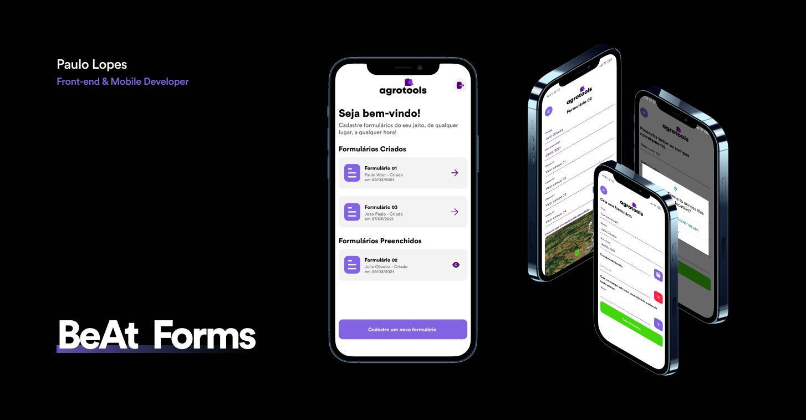

<h1 align="center">
    Beat Forms
</h1>

<p align="center">
  
  
  
  
  

  <a href="https://github.com/lpaulovt/beat-forms/issues">
    
  </a>
  
   
</p>

<p align="center">
  <a href="#rocket-technologies">Technologies</a>&nbsp;&nbsp;&nbsp;|&nbsp;&nbsp;&nbsp;
  <a href="#warning-prerequisites">Prerequisites</a>&nbsp;&nbsp;&nbsp;|&nbsp;&nbsp;&nbsp;
  <a href="#information_source-how-to-use">How To Use</a>&nbsp;&nbsp;&nbsp;|&nbsp;&nbsp;&nbsp;
  <a href="#memo-license">License</a>
</p>

<h1 align="center" height="50vh">
    
</h1>

<p align="center">
  <a href="https://drive.google.com/file/d/1PeZn9UplAAZEpa-4x_-jNAep-NCxgig3/view?usp=sharing" target="_blank">
    
  </a>
</p>
## :rocket: Technologies

This project was developed with the with the following technologies:

- [React Native](http://facebook.github.io/react-native/)
- [Styled Components]()
- [React Native Mapbox]()
- [React Navigation](https://reactnavigation.org/)
- [React Native Gesture Handler](https://kmagiera.github.io/react-native-gesture-handler/)
- [React Native Async Storage]()
- [React Native Svg]()
- [VS Code][vc] with [EditorConfig][vceditconfig] and [ESLint][vceslint]

## :warning: Prerequisites

In order to use and test the app on a simulator or on your smartphone, you should've already setup the development environment for React Native applications. You can follow the following article (PT-BR) to setup your environment:

[React Native Environment (Android/iOS)](https://docs.rocketseat.dev/ambiente-react-native/introducao)

## :information_source: How To Use

To clone and run this application, you'll need [Git](https://git-scm.com), [Node.js v10.16][nodejs] or higher + [Yarn v1.13][yarn] or higher installed on your computer. From your command line:

```bash
# Clone this repository
$ git clone https://github.com/lpaulovt/beat-forms.git

# Go into the repository
$ cd beat-forms

# Install dependencies
$ yarn install

# Run the app (Android)
$ react-native run-android
```

## :memo: License

This project is under the MIT license. See the [LICENSE](https://github.com/lpaulovt/travel-app/blob/main/LICENSE) for more information.

---

Made with ♥ by Paulo Lopes :wave: [Get in touch!](https://www.linkedin.com/in/lpaulovt/)

[nodejs]: https://nodejs.org/
[yarn]: https://yarnpkg.com/
[vc]: https://code.visualstudio.com/
[vceditconfig]: https://marketplace.visualstudio.com/items?itemName=EditorConfig.EditorConfig
[vceslint]: https://marketplace.visualstudio.com/items?itemName=dbaeumer.vscode-eslint
